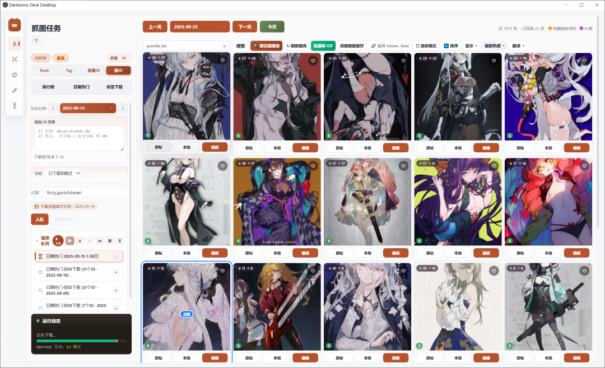
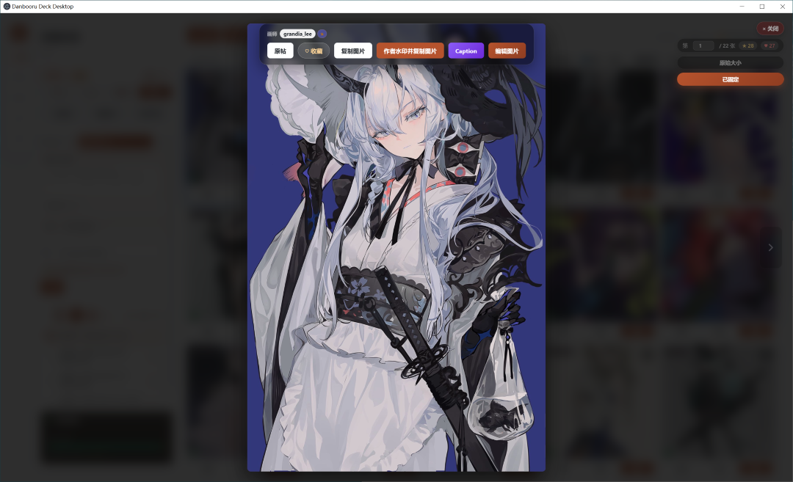

# Danbooru 图片抓取与管理桌面应用

基于 **Electron + Vue 3 + FastAPI** 的桌面端，提供 Danbooru 抓图、本地图库管理、标签翻译和打码编辑等功能。

---

## 📸 界面预览

**抓图主界面** — 左侧配置抓取任务（模式 / 标签 / 起止页 / 日期），右侧本地图库网格；可进入选择模式跨页勾选图片，配合 🗜 加密工具把长 ID 列表压成短串方便分享。



**点击缩略图打开大图查看器** — 信息栏默认悬浮显示（可 📌 固定），支持 ⛶ 原始大小 / ▣ 适应窗口 切换，并提供画师/角色收藏、编辑跳转、上下张切换等。



---

## 🚀 快速开始（Windows）

> 需要 [Python 3.9+](https://www.python.org/downloads/) 和 [Node.js 18+](https://nodejs.org/)。
> 推荐使用 [uv](https://docs.astral.sh/uv/)进行包管理：
>
> ```text
> winget install --id=astral-sh.uv -e
> ```
>
> `setup.bat` 会自动识别 uv 并使用；没装也行，会回退到标准 `venv + pip`。

```text
1. 下载/克隆本仓库
2. 双击 setup.bat   ← 一键创建 .venv、装依赖、编译前端（优先 uv，回退 pip）
3. 双击 start.bat   ← 启动桌面端
```

`setup.bat` 的作用：

- 检查 Python / Node.js / uv
- 在项目根目录创建独立 `.venv`，跑 `uv pip install -r requirements.txt`（或 `pip install`）
- `desktop-app/` 里跑 `npm install` + `npm run build`
- 写入 `env_config.json`，把 Python 路径指向上面的 `.venv`

之后只要双击 `start.bat` 即可启动。需要桌面快捷方式的话，对 `start.bat` 右键 → 发送到 → 桌面快捷方式。

---

## 🚀 快速开始（macOS / Linux）

> 需要 [Python 3.9+](https://www.python.org/downloads/) 和 [Node.js 18+](https://nodejs.org/)。
> macOS 推荐先装 [Homebrew](https://brew.sh/)，再用它把依赖一次装齐：
>
> ```bash
> brew install python node uv      # uv 可选，但强烈推荐（装依赖快一个数量级）
> ```
>
> `setup.sh` 会自动识别 uv 并使用；没装也行，会回退到标准 `venv + pip`。

```bash
1. 下载/克隆本仓库
2. cd 到项目目录
3. chmod +x setup.sh start.sh   ← 首次需要给脚本加执行权限
4. ./setup.sh                   ← 创建 .venv、装依赖、编译前端（优先 uv，回退 pip）
5. ./start.sh                   ← 启动桌面端
```

`setup.sh` 的作用（与 Windows 版 `setup.bat` 一一对应）：

- 检查 Python3 / Node.js / uv
- 在项目根目录创建独立 `.venv`，跑 `uv pip install -r requirements.txt`（或 `pip install`）
- `desktop-app/` 里跑 `npm install` + `npm run build`
- 写入 `env_config.json`，把 Python 路径指向上面 `.venv` 里的 `bin/python`

之后只要执行 `./start.sh` 即可启动。

> 不想加执行权限的话，直接 `bash setup.sh` / `bash start.sh` 也能跑。

---

## 主要功能

- **多模式抓取**：排行榜 / 日期热门 / 日期范围热门 / 仅收集 ID / 按 ID 下载 / 按 Tag 下载。
- **本地库管理**：按下载日期归类（`hot_pic/YYYY-MM-DD/`），支持画师 / 角色搜索、score 排序、筛选格式（图片/视频/动图）。
- **热度刷新**：当前页 / 指定范围 / 全部 三种方式刷新 score、收藏数、画师；范围 >5 页时自动每 4 页休 40s 防风控。
- **画师 / 角色收藏**：点 chip 旁的 ★ 可分组收藏，角色按 `source_hint` 自动合并归类；被收藏的卡片在画廊中异色高亮。
- **标签翻译**：英文角色 tag → 中文，支持在线/手动补全；可导入自定义 `json` 词典。
- **ZIP→GIF 转换**（可选，依赖 FFMPEG，见下文）。
- **打码编辑器**：内置全屏查看器 + EditorPage 打码/水印工具。

---

## 自定义配置环境方案（不想用一键脚本时）

### 1. Python 环境

**推荐：uv**

```bash
uv venv .venv
# Windows
uv pip install --python .venv\Scripts\python.exe -r requirements.txt
# macOS / Linux
uv pip install --python .venv/bin/python -r requirements.txt
```

> uv 自动处理 Python 发现、venv 创建、并行下载和 wheel 缓存，第一次完整安装通常在 10 秒级。

其它方式也行：


Anaconda：

```bash
conda create -n danbooru python=3.10
conda activate danbooru
pip install -r requirements.txt
```

venv：

```bash
python -m venv .venv
.venv\Scripts\activate          # Windows
source .venv/bin/activate       # macOS / Linux
pip install -r requirements.txt
```

### 2. 指定 Python 解释器

桌面端启动时按以下顺序寻找 Python：

1. 项目根目录的 `env_config.json` 中 `python_path` 字段（绝对路径，Windows 注意 JSON 里反斜杠要写成 `\\`）
2. 环境变量 `WEB_MOSAIC_PYTHON`
3. 系统 `PATH` 中的 `python` / `py -3`

`setup.bat`（Windows）/ `setup.sh`（macOS / Linux）会自动生成 `env_config.json`；手动写时格式如下：

Windows（注意 JSON 里反斜杠要写成 `\\`）：

```json
{
    "python_path": "D:\\Anaconda3\\envs\\danbooru\\python.exe"
}
```

macOS / Linux（正斜杠，无需转义）：

```json
{
    "python_path": "/Users/you/web_mosaic_gpt/.venv/bin/python"
}
```

提示：在激活的环境里跑 `where python`（Windows）/ `which python3`（macOS / Linux）取第一行即可。

### 3. 前端

```bash
cd desktop-app
npm install
npm run build      # 生产构建（start.bat 走这条）
npm run dev        # 开发模式（带热重载 + Electron）
```

---

## 可选：FFMPEG（仅 ZIP→GIF 转换需要）

抓图、管理、打码都不需要 FFMPEG。**只有点"转 GIF"按钮时**才会调用它。需要时任选其一：

```bash
winget install Gyan.FFmpeg   # Windows
brew install ffmpeg          # macOS
```

或从 [FFMPEG 官网](https://ffmpeg.org/download.html) 下载，把 `bin/` 加入系统 `PATH`，在终端中验证：

```bash
ffmpeg -version
```

---

## 无法连接 Danbooru？

国内网络偶尔会被运营商劫持，可以改 hosts 绕过。

文件位置：

- Windows：`C:\Windows\System32\drivers\etc\hosts`（用管理员权限编辑）
- macOS / Linux：`/etc/hosts`（`sudo nano /etc/hosts`）

在末尾追加一行：

```text
104.26.11.39 danbooru.donmai.us
```

桌面端右上角的「无法连接？修改Hosts教程」按钮里也有同样的说明。

---

## Electron 装不上 / 报 "Electron failed to install correctly"？

`npm install` 会在 postinstall 阶段从 GitHub 下载约 285MB 的 Electron 本体，国内网络经常失败，导致 `npm run dev` / `start.bat` 报：

```text
Error: Electron failed to install correctly, please delete node_modules/electron and try installing again
```

本仓库已在 `desktop-app/.npmrc` 里把下载源指向国内镜像（npmmirror），正常情况下直接重装即可：

```bash
cd desktop-app
rmdir /s /q node_modules\electron      # Windows
# rm -rf node_modules/electron         # macOS / Linux
npm install
```

仍失败的话，多半是 `@electron/get` 缓存了半截的坏文件，清掉再装：

```bash
# Windows
rmdir /s /q "%LOCALAPPDATA%\electron\Cache"
# macOS / Linux
rm -rf ~/.cache/electron ~/Library/Caches/electron
```

想用别的镜像或走默认源，改 `desktop-app/.npmrc` 里的 `electron_mirror`，或设环境变量 `ELECTRON_MIRROR` 覆盖。

---

## 项目结构

```text
.
├── setup.bat / start.bat   # 一键安装 / 启动（Windows）
├── setup.sh  / start.sh    # 一键安装 / 启动（macOS / Linux）
├── main.py                 # FastAPI 后端入口
├── translator.py           # 标签翻译核心
├── requirements.txt        # Python 依赖
├── env_config.json         # 桌面端用来找 Python 的配置（setup.bat 自动生成）
├── custom_translation.json # 用户自定义翻译词典
├── artist_favorites.json   # 画师收藏（分组）
├── character_favorites.json# 角色收藏（按 source_hint 合并）
├── hot_pic/                # 下载根目录，按日期归档
├── exiftool/               # 已自带，无需另装
└── desktop-app/            # Electron + Vue 3 前端
    ├── electron/main.cjs   # Electron 主进程，负责拉起 Python 后端
    └── src/                # Vue 源码（CrawlerPage / EditorPage / FavoritesPage）
```

---
*Created by Claude Code AI assistant.*
